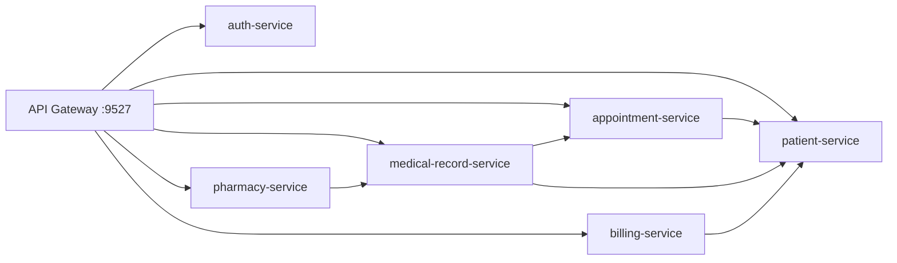

# System Architecture

## Microservices

| Service | Port | Responsibility |
| --- | ---: | --- |
| gateway-service | 9527 | Unified API entry, route forwarding, JWT authentication |
| auth-service | 9001 | Login authentication and JWT token issuing |
| patient-service | 9002 | Patient profiles, patient summaries, Redis cache-aside demo |
| appointment-service | 9003 | Departments, doctors, schedules, appointments, patient Feign lookup |
| medical-record-service | 9004 | Electronic medical records and medical orders |
| pharmacy-service | 9005 | Drug catalog, inventory inbound, inventory flows, dispensing |
| billing-service | 9006 | Bills, bill items, payments, payment status transitions |
| admin-service | 9007 | Dictionary management and operation logs |

## Runtime Components

- MySQL: one schema per business service.
- Redis: patient detail cache-aside storage.
- Nacos Discovery: service registration and discovery for gateway load-balanced routes and Feign calls.
- Nacos Config: dynamic demo config through `dmis.demo.config-message`.
- Gateway: public login endpoint plus protected business endpoints.
- SpringDoc: Swagger UI per service.

## Remote Call Chain



## Demo Links

- Login: `POST http://localhost:9527/api/auth/login`
- Gateway auth: call business APIs with `Authorization: Bearer <token>`
- Redis cache demo: `GET http://localhost:9527/api/patients/{id}/cache-demo`
- Remote call demo: `GET http://localhost:9527/api/appointments/demo/remote-patient/1`
- Config center demo: `GET http://localhost:9527/api/config/patient/demo/config`
- Nacos console: `http://localhost:8848/nacos`

## Infrastructure Startup

```powershell
docker compose up -d mysql redis nacos
```
