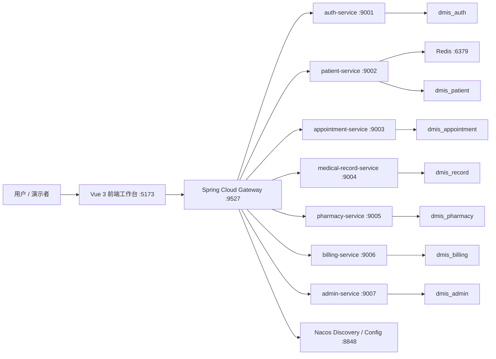
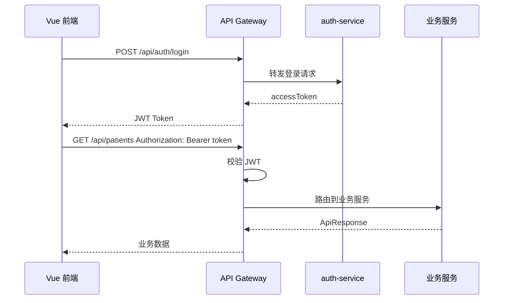

# DMIS 系统架构说明

## 1. 总体架构

DMIS 采用前后端分离 + Spring Cloud 微服务架构。前端 Vue 3 工作台只访问 `/api/**`，由 Vite 开发代理转发到 API 网关；后端所有业务服务通过 Nacos 注册发现，由 Spring Cloud Gateway 统一路由，并通过 JWT 完成登录认证和接口保护。



## 2. 技术栈

| 层级 | 技术 | 作用 |
| --- | --- | --- |
| 前端 | Vue 3、Vite、lucide-vue-next | 登录页、业务工作台、表单交互、列表展示、联调验证 |
| 网关 | Spring Cloud Gateway | 统一入口、路由转发、JWT 鉴权 |
| 后端 | Spring Boot 3、Spring Web、Spring Validation、Spring Data JPA | 业务接口、参数校验、数据库访问 |
| 微服务治理 | Spring Cloud、Spring Cloud Alibaba、Nacos | 服务注册发现、配置中心 |
| 服务间调用 | OpenFeign | 预约校验患者、病历校验患者/预约、药房校验医嘱、账单校验患者 |
| 缓存 | Redis | 患者详情 cache-aside 缓存演示 |
| 数据库 | MySQL 8 | 按服务拆分业务库 |
| 文档 | SpringDoc OpenAPI / Swagger UI | 每个服务自动生成接口文档 |
| 测试 | JUnit 5、Mockito、Maven Surefire | 后端单元测试与验证 |
| 运维脚本 | Docker Compose、PowerShell | 一键启动/关闭、Nacos 配置导入、冒烟测试 |

## 3. 微服务拆分

| 服务 | 端口 | 数据库 | 主要职责 |
| --- | ---: | --- | --- |
| gateway-service | 9527 | 无 | API 统一入口、路由、JWT 认证过滤 |
| auth-service | 9001 | dmis_auth | 登录认证、JWT Token 签发 |
| patient-service | 9002 | dmis_patient | 患者档案 CRUD、患者摘要、Redis 缓存演示 |
| appointment-service | 9003 | dmis_appointment | 科室、医生、排班、预约、患者远程校验 |
| medical-record-service | 9004 | dmis_record | 电子病历、医嘱记录、患者/预约远程校验 |
| pharmacy-service | 9005 | dmis_pharmacy | 药品目录、库存入库、库存流水、发药、医嘱远程校验 |
| billing-service | 9006 | dmis_billing | 账单、账单明细、支付、患者远程校验 |
| admin-service | 9007 | dmis_admin | 字典数据、操作日志、检索中心数据源 |

## 4. 服务注册与发现

所有后端服务启动后会注册到 Nacos：

```text
http://localhost:8848/nacos
```

演示时可以在 Nacos 服务列表查看：

- `gateway-service`
- `auth-service`
- `patient-service`
- `appointment-service`
- `medical-record-service`
- `pharmacy-service`
- `billing-service`
- `admin-service`

关闭任意服务后，Nacos 服务实例会消失或变为不可用，可用于演示服务注销。

## 5. 网关与认证链路



未携带 Token 访问业务接口时，网关返回未认证错误；登录接口本身放行。

## 6. 远程调用链路

系统存在多个服务间的数据交换：

| 调用方 | 被调用方 | 场景 |
| --- | --- | --- |
| appointment-service | patient-service | 创建预约前校验患者是否存在 |
| medical-record-service | patient-service | 创建病历前校验患者 |
| medical-record-service | appointment-service | 创建病历时校验预约归属 |
| pharmacy-service | medical-record-service | 发药前校验医嘱有效 |
| billing-service | patient-service | 创建账单前校验患者 |

演示入口：

```text
GET http://localhost:9527/api/appointments/demo/remote-patient/{patientId}
```

## 7. Redis 缓存设计

患者详情采用 cache-aside 策略：

1. 查询患者详情时先查 Redis。
2. 缓存未命中时查询 MySQL。
3. 查询成功后写入 Redis，并设置 TTL。
4. 更新或删除患者档案时清理缓存。

演示入口：

```text
GET http://localhost:9527/api/patients/{id}/cache-demo
```

示例 key：

```text
patient:detail:{id}
```

## 8. 配置中心设计

各服务使用 Nacos Config 加载配置：

```yaml
spring:
  config:
    import: optional:nacos:${spring.application.name}.yml
```

演示配置项：

```text
dmis.demo.config-message
```

演示入口：

```text
GET http://localhost:9527/api/config/patient/demo/config
```

修改 Nacos 配置后，可通过 `/actuator/refresh` 刷新配置，再访问接口验证配置变更。

## 9. 前端工作台架构

前端当前为单页工作台设计，重点服务演示验收：

- 独立登录页：展示系统说明、演示账号、JWT 登录。
- 业务导航：患者管理、预约排班、病历医嘱、药房库存、电子账单、检索中心、联调验证。
- 数据访问：统一调用 `/api/**`，由 Vite 代理到 `http://localhost:9527`。
- 状态处理：Token 保存在 `localStorage`，业务请求自动附加 Bearer Token。
- 错误反馈：统一 toast 展示后端错误或 HTTP 错误。

## 10. 数据库设计概览

系统采用按服务分库：

| 数据库 | 核心表 |
| --- | --- |
| dmis_auth | `sys_user`、`sys_role`、`sys_permission` |
| dmis_patient | `patient_info`、`patient_contact`、`patient_visit_summary` |
| dmis_appointment | `department_info`、`doctor_info`、`doctor_schedule`、`appointment_record` |
| dmis_record | `medical_record`、`medical_order` |
| dmis_pharmacy | `drug_info`、`drug_inventory`、`inventory_flow`、`dispense_record` |
| dmis_billing | `billing_record`、`billing_item`、`payment_record` |
| dmis_admin | `sys_dict_type`、`sys_dict_item`、`sys_operation_log` |

完整表设计见 `docs/database-design.md`。

## 11. 日常启动与关闭

一键启动：

```powershell
.\scripts\start-dev.ps1
```

一键关闭：

```powershell
.\scripts\stop-dev.ps1
```

详细说明见根目录 `README.md`。

## 12. 演示入口

| 内容 | 地址或文档 |
| --- | --- |
| 前端工作台 | `http://localhost:5173` |
| API 网关 | `http://localhost:9527` |
| Nacos 控制台 | `http://localhost:8848/nacos` |
| Swagger UI | `http://localhost:9001/swagger-ui.html` 至 `9007` |
| API 汇总 | `docs/api-progress.md` |
| Demo 运行手册 | `docs/demo-runbook.md` |
| Demo 视频脚本 | `docs/demo-video-script.md` |
